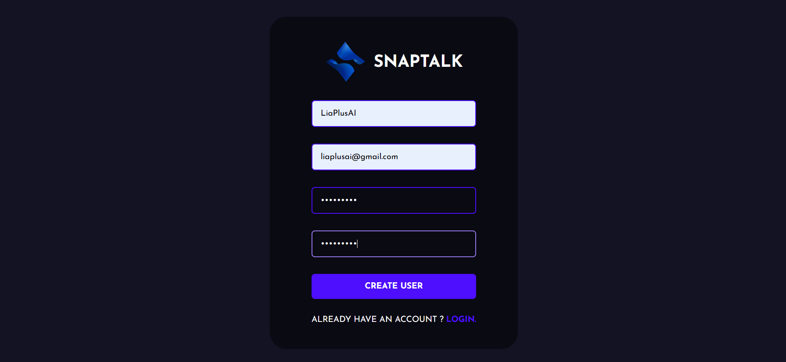
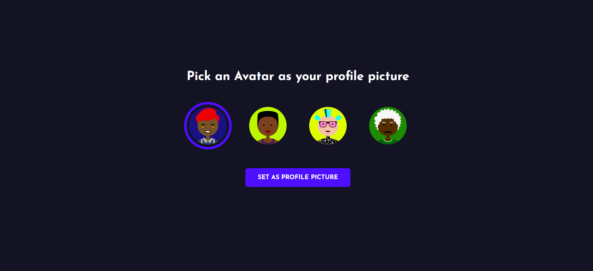
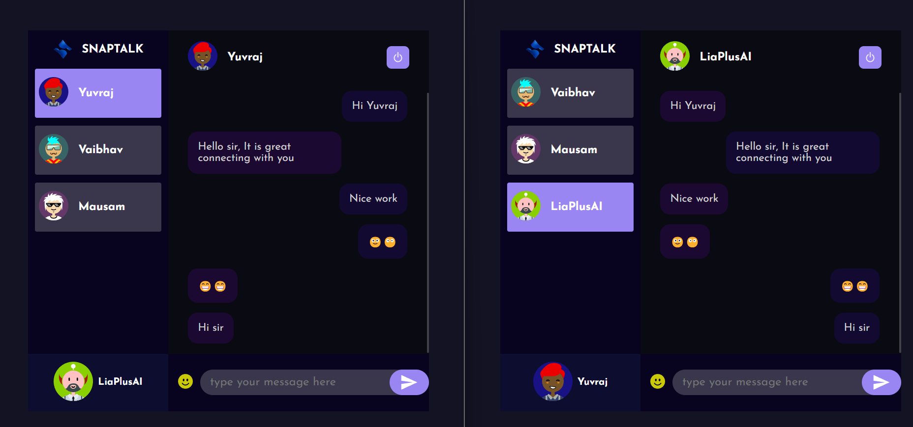

# SnapTalk - A Live Chat Application

SnapTalk is a real-time chat application built with the power of the MERN stack (MongoDB, Express.js, React.js, Node.js). It allows users to chat seamlessly, share messages, and emojies making it a versatile and robust communication tool.









## Installation Guide

### Requirements
- [Nodejs](https://nodejs.org/en/download)
- [Mongodb](https://www.mongodb.com/docs/manual/administration/install-community/)

## Features
- **Real-time Messaging:** Instantly send and receive messages.
- **User Authentication:** Sign up, log in.
- **Avatar Profile:** User can create their avatar profile.
- **Responsive Design:** Fully responsive UI, optimized for mobile and desktop devices.

## Installation Guide

### Prerequisites
Before you begin, ensure that the following tools are installed on your system:
- [Node.js](https://nodejs.org/en/download)
- [MongoDB](https://www.mongodb.com/docs/manual/administration/install-community/)

Ensure MongoDB is running before proceeding with the installation.

### Installation Steps

#### First Method: Manual Installation

1. **Clone the Repository**  
   Clone the repository to your local machine using the following command:
   ```shell
   git clone https://github.com/yuvrajsingh833/SnapTalk.git
   cd SnapTalk-A Live Chatting Application
   ```

2. **Rename Environment Files**  
   Rename the `.env.example` files to `.env` in both the client and server folders.
   ```shell
   cd public
   mv .env.example .env
   cd ..
   cd server
   mv .env.example .env
   cd ..
   ```

3. **Install Dependencies**  
   Install the required dependencies for both the server and client.
   ```shell
   cd server
   yarn
   cd ..
   cd public
   yarn
   ```

4. **Start the Development Server**  
   - For the Frontend:
     ```shell
     cd public
     yarn start
     ```
   - For the Backend:  
     Open a new terminal window and make sure MongoDB is running in the background.
     ```shell
     cd server
     yarn start
     ```

5. **Access the Application**  
   Open your browser and navigate to `http://localhost:3000` to see the application in action.

#### Second Method: Using Docker (for Containerization)

This method is ideal if you want to run SnapTalk inside Docker containers.

1. **Build the Docker Containers**  
   Make sure Docker and Docker Compose are installed on your machine. In the root directory of the project, run:
   ```shell
   docker compose build --no-cache
   ```

2. **Start the Containers**  
   Once the build is complete, use the following command to start the containers:
   ```shell
   docker compose up
   ```

3. **Access the Application**  
   Open your browser and go to `http://localhost:3000` to access the application.

---

## Project Structure

- **`server/`**: Contains the backend code (Node.js, Express.js, MongoDB).
- **`public/`**: Contains the frontend code (React.js).

---

## Technologies Used

- **MongoDB**: NoSQL database for storing user data, messages, and group chats.
- **Express.js**: Web framework for building the backend API.
- **React.js**: Frontend framework for building interactive UIs.
- **Node.js**: JavaScript runtime for server-side development.
- **Socket.io**: Enables real-time bi-directional communication between clients and the server.
